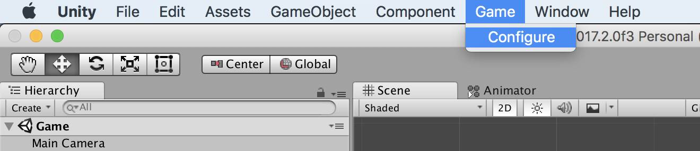
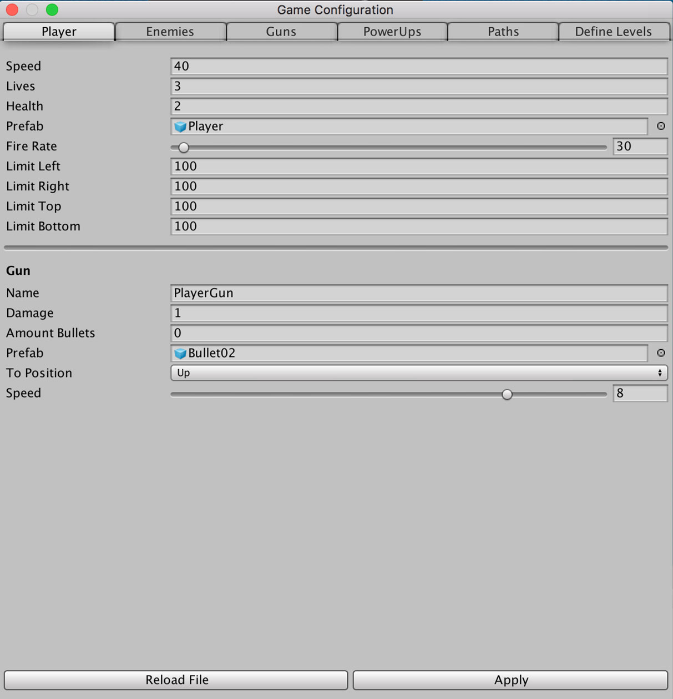
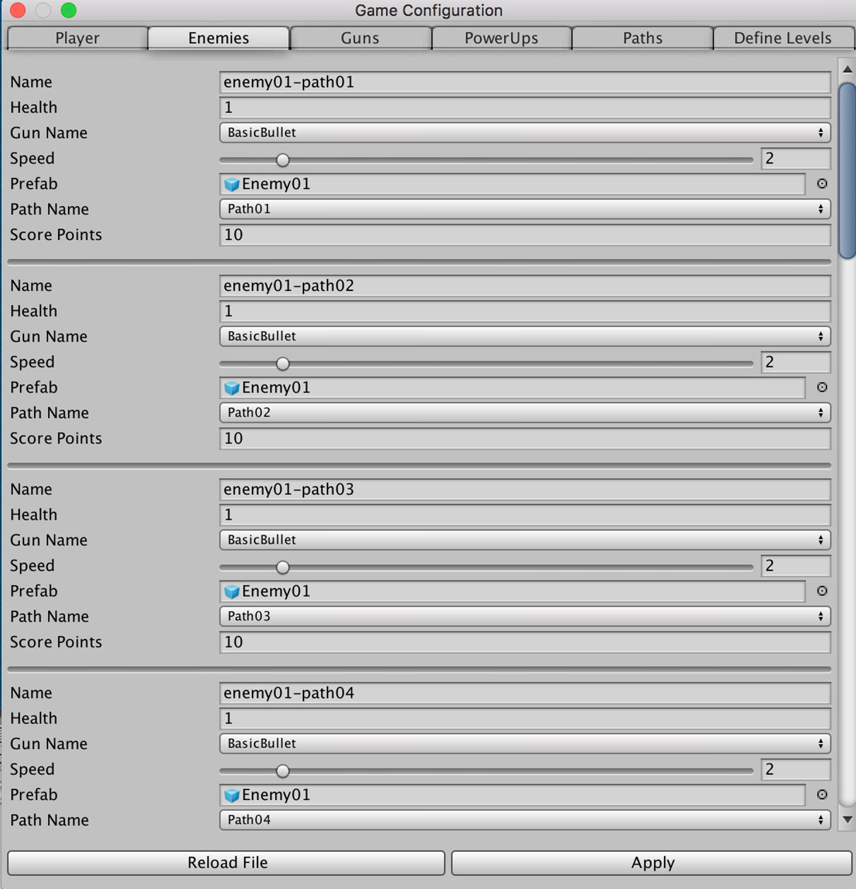
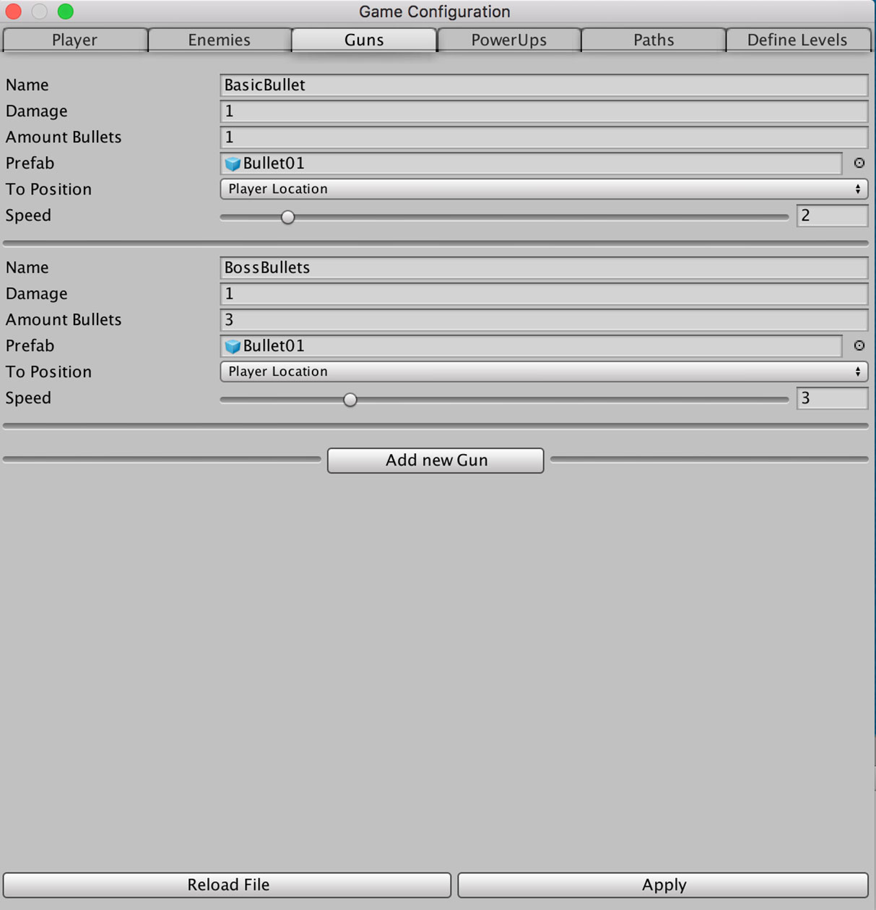
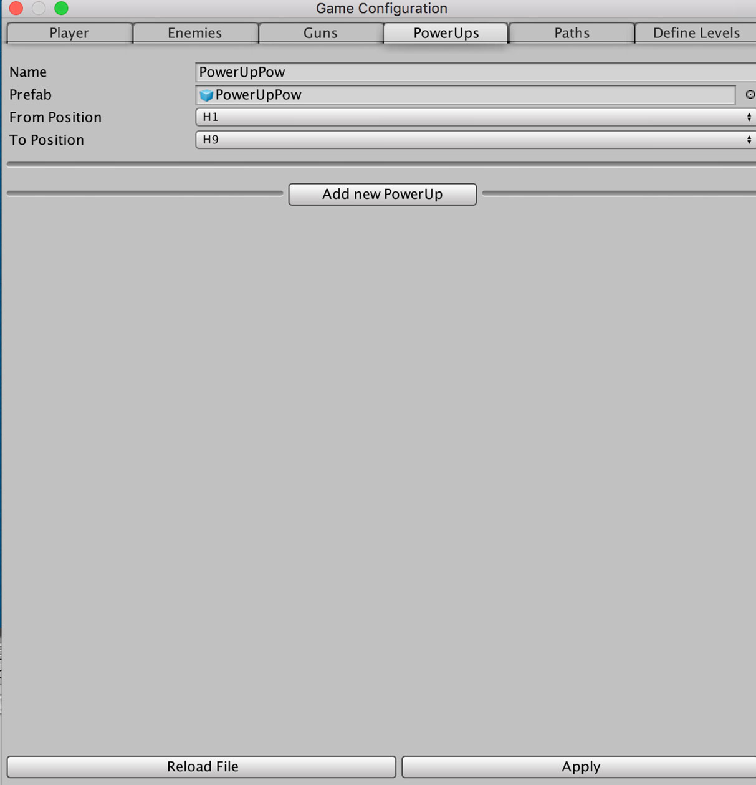
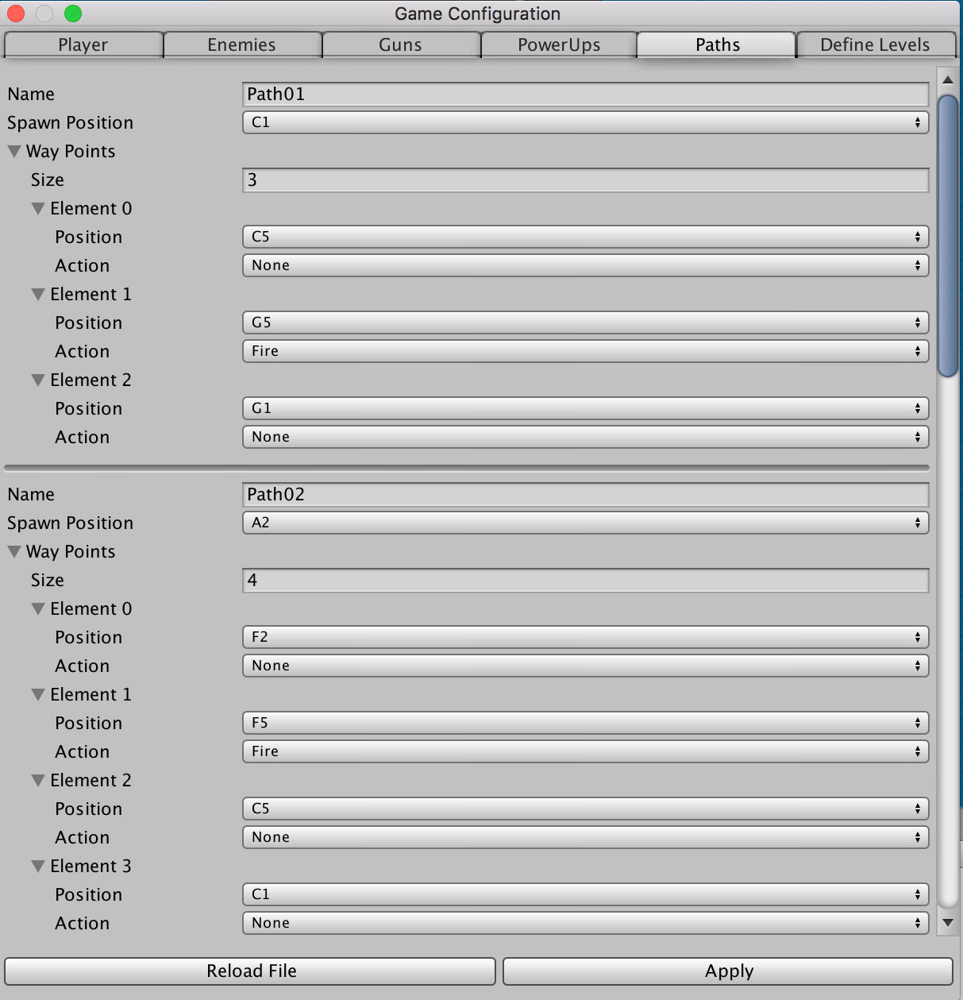
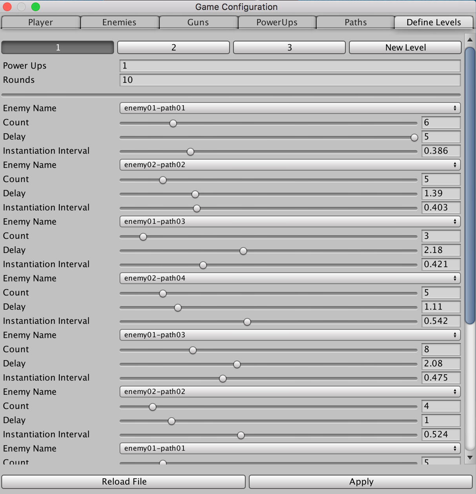

# **LM-1942**

## Configure Game
After load the project you can find in the `Unity`'s menu bar, a new option `Game`. To start configuring your game you must enter into the `Configure` option displayed above, as it's shown in the next image.

Configure the Game (enemies, guns, player settings, powerUps, add the levels that you want). Once you configured the game, press `Apply` to save the changes. All the changes you make will be persisted into a file named `levels.json` into Resources Folder.

If you want to restore the changes made in your game and they are not saved yet press the `Reload File` button. This will reload the saved configuration of your game.

### Player Settings
You can define in this section Player settings (use the prefab that you want and many other basic setting needed)

### Enemies
This section allows you to define the enemies in the game.
`Path Name` and `Gun Name` are Dropdown menus filled with the content setted in `Guns` and `Paths`.

### Guns
You can also define the enemy guns (use a prefab that you want), and you can define the target position (Player location or a coordinate of the screen)

### PowerUps
This version just support one powerUp (a enhance gun), is easy to add more, but for this MVP, I think it Ok with one to show the implementation.

### Paths
This section allows you to define the paths of way points of the enemies in the screen. It a good way to create new levels with different enemy patterns without needs to create animations. Position are defined with coordinates (x, y), where A-I are X positions, and 1-9 are Y positions.

### Levels
This is the funniest part of this configurator, you can define the current levels (just 3 🤦‍♂️) and add others!
The logic behind it is configure different Rounds of enemies (a group of enemies of the same type with a path configured).

#### Developer: Lucas Monje
